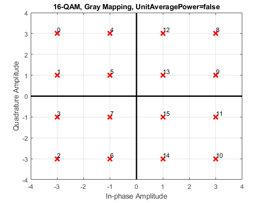
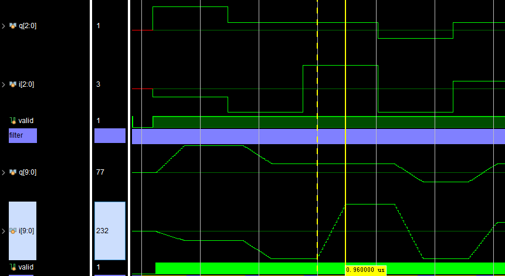
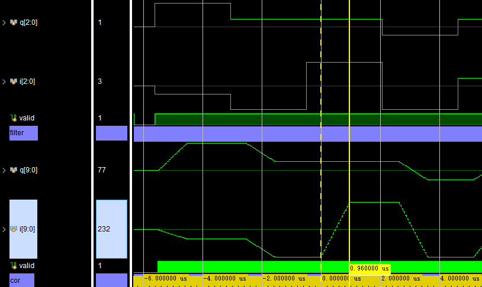
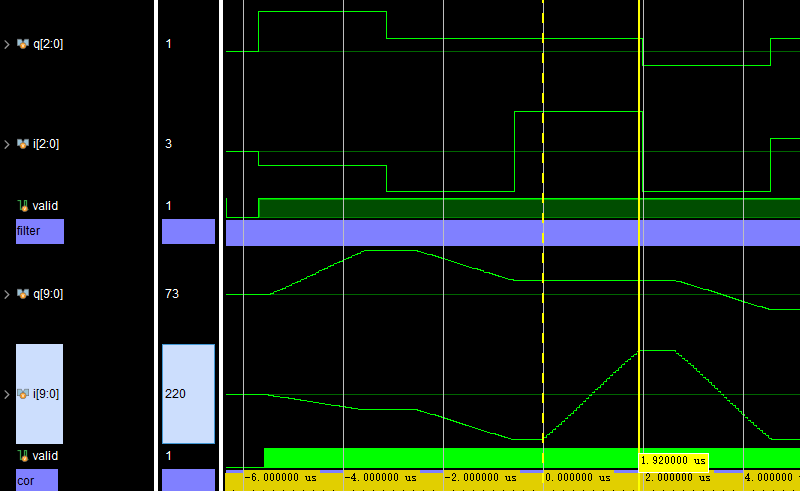
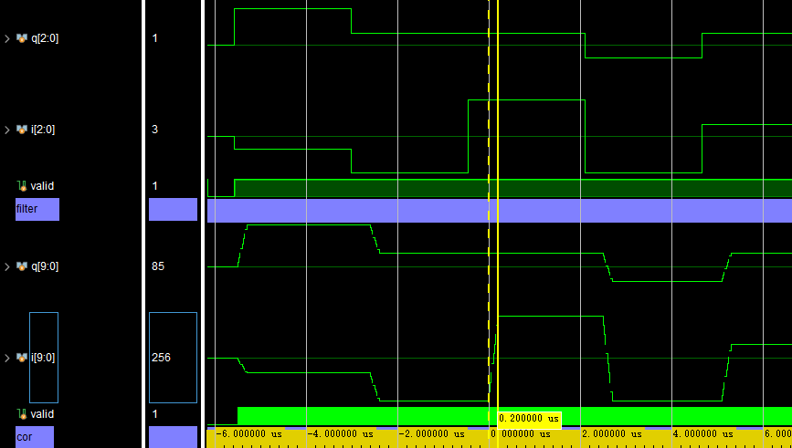

# QAM-16
QAM-16

# The influence of rise cosine parameters on the filter

## order = 32, roll-off = 0.1

## order = 32, roll-off = 0.25

## order = 64, roll-off = 0.1

## order = 8, roll-off = 0.1

延时时间 = 采样周期*阶数

